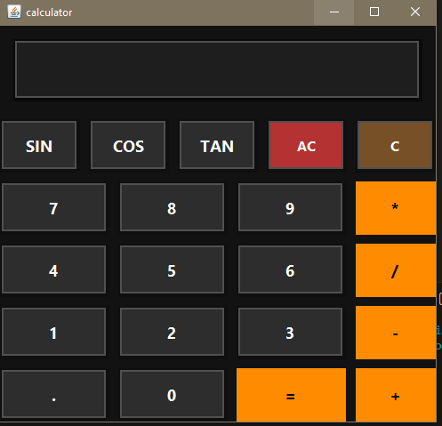

# Java Calculator 🧮

** Author : Muhammad Mueenuddeen**
**Github : https://github.com/mhd-1111

A modern Java Swing Calculator application with a clean UI and scientific functions.

## ✨ Features
- Basic arithmetic operations (+, −, ×, ÷)
- Scientific functions (sin, cos, tan)
- Clear (AC) and backspace (C)
- Expression display with history
- Dark-themed modern UI
- Error handling (division by zero, syntax errors)

## 🛠️ Built With
- Java
- Java Swing (GUI)
- VS Code

## 🚀 How to Run
1. Make sure Java is installed
2. Compile the program:
   `bash
   javac Mycalculator.java

   run the program :
    java Mycalculator

    ## 📸 Preview
    

